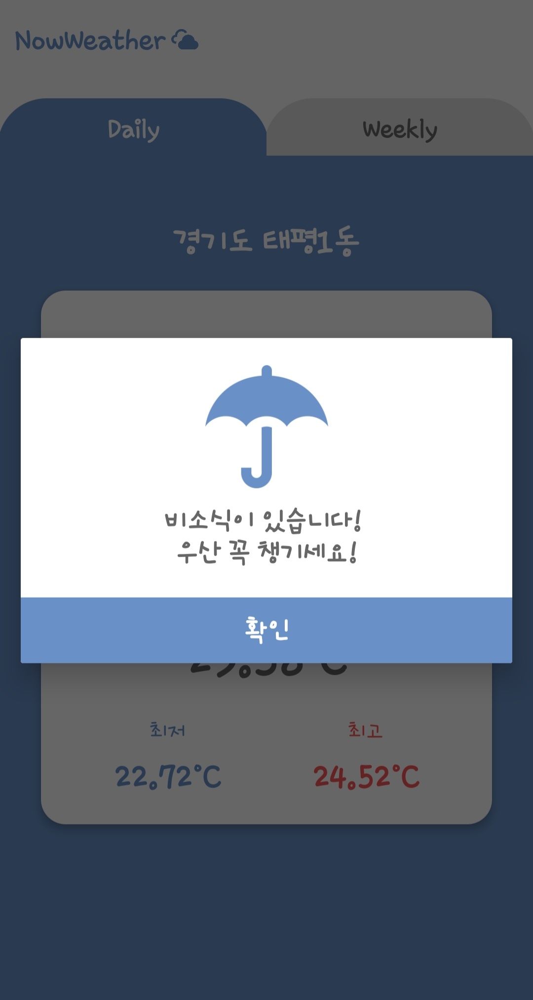
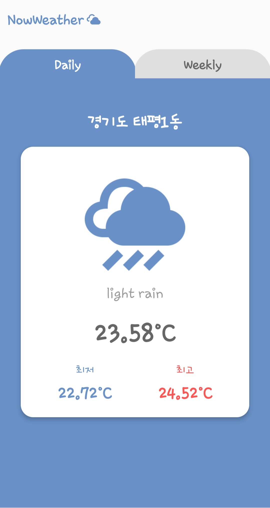
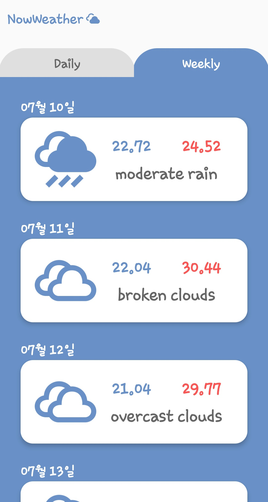

# NowWeather

1. OpenWeatherMap API 사용
2. retrofit 사용
3. Geocoder, LocationManager 사용
4. 현재 지역 위도, 경도값으로 API 호출
5. 현재날씨, 일주일날씨 간편하게 보여줌
6. 오늘 비소식 있을시 우산 팝업 알림

** 스크린샷 **
{: width="100" height="100"}

